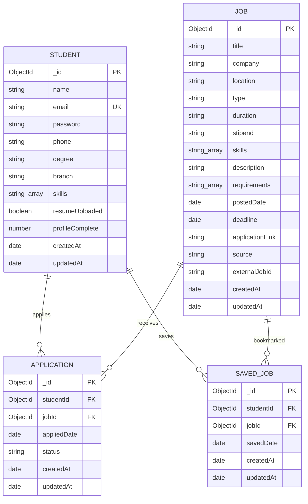

# Database Design for Job / Internship System

## Project Overview

This project is a student job and internship portal. Students can register, login, update their profile, upload skills from resume, browse jobs, apply for jobs, and save jobs for later.

The backend currently uses MongoDB database:

```text
jobApp
```

The existing `User.js` model is not used anywhere in the backend, so it is removed from the final database design. The correct database design should focus on these four collections:

1. `students`
2. `jobs`
3. `applications`
4. `saved_jobs`

## Final Collections

### 1. students

The `students` collection stores student account, login, profile, resume, and skill details.

| Field Name | Data Type | Constraint | Description |
| --- | --- | --- | --- |
| `_id` | ObjectId | Primary Key | Unique student identifier |
| `name` | String | Required | Full name of the student |
| `email` | String | Required, Unique | Student email used for login |
| `password` | String | Required | Student password |
| `phone` | String | Required | Student mobile number |
| `degree` | String | Required | Student degree/course |
| `branch` | String | Required | Student branch/department |
| `skills` | Array of String | Default empty array | Skills of the student |
| `resumeUploaded` | Boolean | Default false | Shows whether resume/skills were uploaded |
| `profileComplete` | Number | Default 85 | Profile completion percentage |
| `createdAt` | Date | Auto | Student account creation date |
| `updatedAt` | Date | Auto | Last profile update date |

Recommended indexes:

```text
email unique
skills
```

### 2. jobs

The `jobs` collection stores job and internship details. Jobs can be manually added by admin or fetched from an external job API.

| Field Name | Data Type | Constraint | Description |
| --- | --- | --- | --- |
| `_id` | ObjectId | Primary Key | Unique job identifier |
| `title` | String | Required | Job or internship title |
| `company` | String | Required | Company name |
| `location` | String | Required | Job location |
| `type` | String | Required | Internship, Full-time, or Part-time |
| `duration` | String | Required | Internship duration or permanent |
| `stipend` | String | Required | Stipend or salary |
| `skills` | Array of String | Required | Skills required for the job |
| `description` | String | Required | Complete job description |
| `requirements` | Array of String | Optional | Eligibility or technical requirements |
| `postedDate` | Date | Default current date | Date when job was posted |
| `deadline` | Date | Required | Last date to apply |
| `applicationLink` | String | Optional | Link used to apply for the job |
| `source` | String | Default manual | manual or adzuna |
| `externalJobId` | String | Optional | External API job ID if available |
| `createdAt` | Date | Auto | Job creation date |
| `updatedAt` | Date | Auto | Last job update date |

Recommended indexes:

```text
title
company
location
type
skills
deadline
externalJobId
```

### 3. applications

The `applications` collection stores each job application submitted by a student.

| Field Name | Data Type | Constraint | Description |
| --- | --- | --- | --- |
| `_id` | ObjectId | Primary Key | Unique application identifier |
| `studentId` | ObjectId | Foreign Key | References `students._id` |
| `jobId` | ObjectId | Foreign Key | References `jobs._id` |
| `appliedDate` | Date | Default current date | Date when student applied |
| `status` | String | Default Applied | Applied, Shortlisted, Rejected, or Selected |
| `createdAt` | Date | Auto | Application creation date |
| `updatedAt` | Date | Auto | Last status update date |

Recommended unique index:

```text
studentId + jobId
```

This prevents duplicate applications for the same job by the same student.

### 4. saved_jobs

The `saved_jobs` collection stores jobs bookmarked by students.

| Field Name | Data Type | Constraint | Description |
| --- | --- | --- | --- |
| `_id` | ObjectId | Primary Key | Unique saved-job identifier |
| `studentId` | ObjectId | Foreign Key | References `students._id` |
| `jobId` | ObjectId | Foreign Key | References `jobs._id` |
| `savedDate` | Date | Default current date | Date when job was saved |
| `createdAt` | Date | Auto | Record creation date |
| `updatedAt` | Date | Auto | Last update date |

Recommended unique index:

```text
studentId + jobId
```

This prevents the same student from saving the same job repeatedly.

## Relationship Design

| Relationship | Cardinality | Explanation |
| --- | --- | --- |
| Student to Application | One-to-Many | One student can apply to many jobs |
| Job to Application | One-to-Many | One job can receive many applications |
| Student to Saved Job | One-to-Many | One student can save many jobs |
| Job to Saved Job | One-to-Many | One job can be saved by many students |

## ER Diagram



